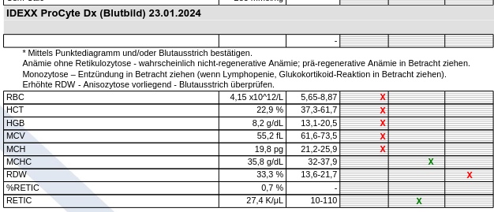
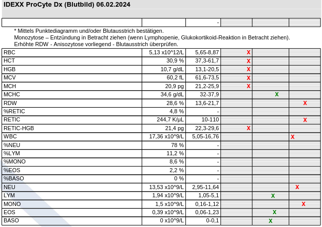
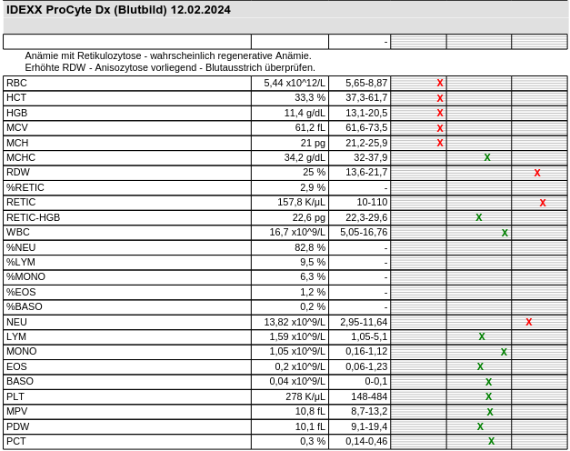
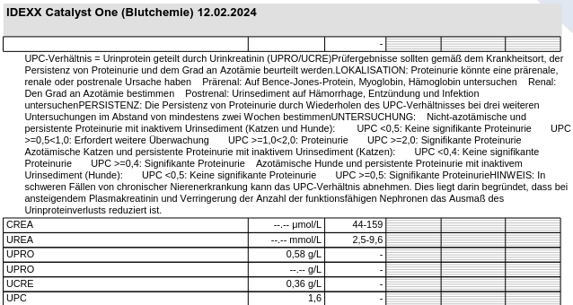
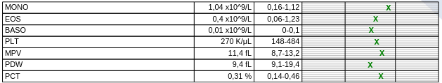
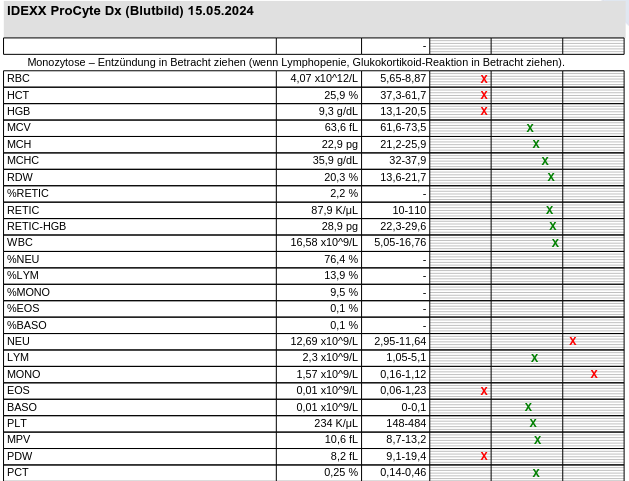
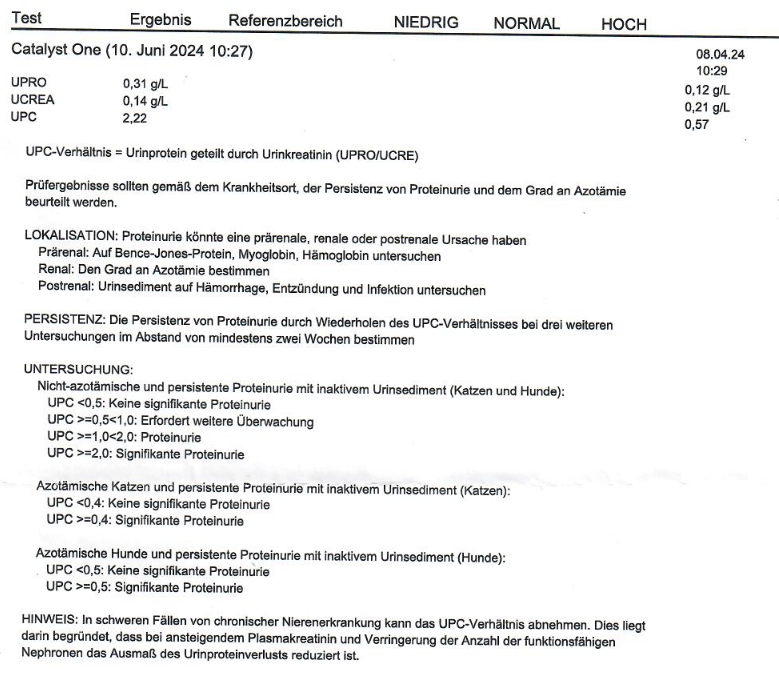

.. _tests:

.. |blood_2024-01-09_1| image:: ../_static/img/2024-01-09_blood1.png
   :class: wiki-img

.. |blood_chem_2024-01-09| image:: ../_static/img/2024-01-09_blood_chem.png
   :class: wiki-img

.. |blood_2024-01-23_2| image:: ../_static/img/2024-01-23_blood2.png
   :class: wiki-img

.. |blood_2024-02-06_2| image:: ../_static/img/2024-02-06_blood2.png
   :class: wiki-img

.. |blood_2024-02-19_1| image:: ../_static/img/2024-02-19_blood1.png
   :class: wiki-img

.. |blood_2024-02-26| image:: ../_static/img/2024-02-26_blood.png
   :class: wiki-img

.. |blood_2024-03-18_1| image:: ../_static/img/2024-03-18_blood1.png
   :class: wiki-img

.. |blood_2024-03-18_2| image:: ../_static/img/2024-03-18_blood2.png
   :class: wiki-img

.. |blood_chem_2024-03-18| image:: ../_static/img/2024-03-18_blood_chem.png
   :class: wiki-img

.. |blood_2024-06-01| image:: ../_static/img/2024-06-01_blood.png
   :class: wiki-img

.. |blood_2024-06-10| image:: ../_static/img/2024-06-10_blood.png
   :class: wiki-img

.. |blood_2024-06-15| image:: ../_static/img/2024-06-15_blood.png
   :class: wiki-img

.. |blood_2024-06-24_1| image:: ../_static/img/2024-06-24_blood1.png
   :class: wiki-img

.. |blood_2024-06-24_2| image:: ../_static/img/2024-06-24_blood2.png
   :class: wiki-img

===================
4 - Test Ergebnisse
===================

.. include:: ../_inc/head.rst

Ergebnisse von Tests.

Blut
****

2024-01-09
==========

|blood_2024-01-09_1|

|blood_2024-01-09_2|

2024-01-23
==========

|blood_2024-01-23_1|

|blood_2024-01-23_2|

2024-02-06
==========

|blood_2024-02-06_1|

|blood_2024-02-06_2|

2024-02-12
==========

|blood_2024-02-12|

2024-02-19
==========

|blood_2024-02-19_1|

|blood_2024-02-19_2|

2024-02-26
==========

|blood_2024-02-26|

2024-03-18
==========

|blood_2024-03-18_1|

|blood_2024-03-18_2|

2024-05-15
==========

|blood_2024-05-15|

2024-06-01
==========

|blood_2024-06-01|

2024-06-10
==========

|blood_2024-06-10|

2024-06-15
==========

|blood_2024-06-15|

2024-06-24
==========

|blood_2024-06-24_1|

|blood_2024-06-24_2|

----

Blutchemie
**********

2024-01-09
==========

|blood_chem_2024-01-09|

2024-02-12
==========

|blood_chem_2024-02-12|

2024-03-18
==========

|blood_chem_2024-03-18|

2024-06-10
==========

|blood_chem_2024-06-10|
