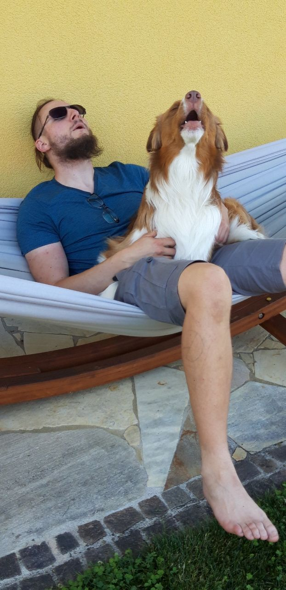

.. _2023_08:

=======
2023-08
=======

.. include:: ../_inc/head.rst

Status
******

Hund isst ab und zu sein Trockenfutter nicht, Ausdauer ist etwas schlechter (fällt beim Wandern auf)

Er hat sonst einen sehr starken Futtertrieb. Daher ist dieses Verhalten doch recht eigenartig.

----

Bilder
******

|hawl|
