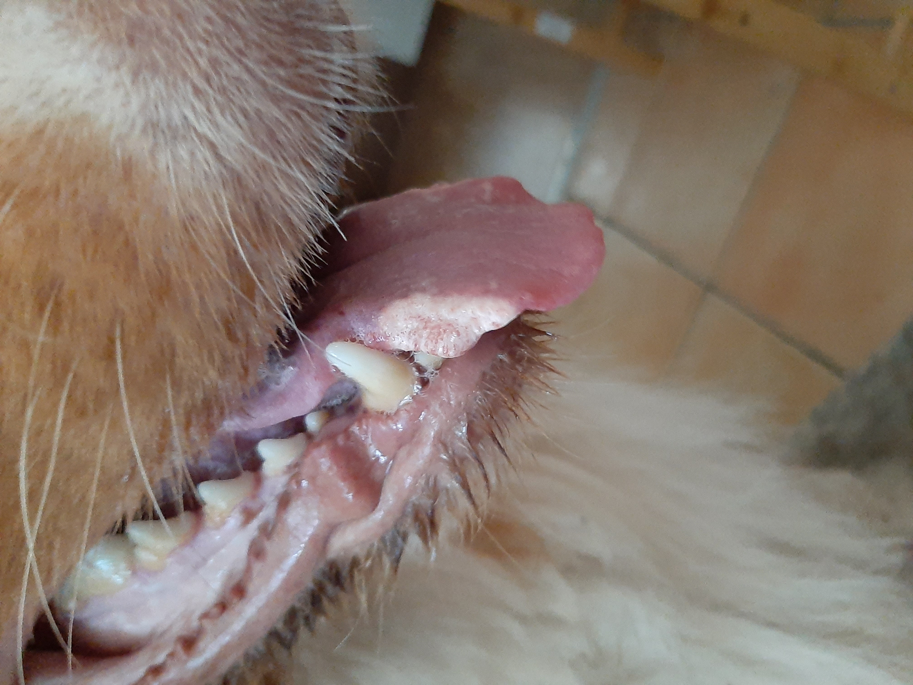

.. _2024_07:

.. |tounge2| image:: ../_static/img/2024-07-24_tounge2.jpg
   :class: wiki-img

=======
2024-07
=======

.. include:: ../_inc/head.rst

Status
******

2024-07-01
==========

Entzündungswerte haben sich eingependelt. Blutkörperchen sind auch wieder um ein wenig gestiegen.

2024-07-08
==========

Schnee-Weiße Flecken werden auf der Zunge des Hundes entdeckt.

2024-07-15
==========

Kontrolle in der Tierklinik Gleisdorf. Zunge wird überprüft - doch ohne weiteres Vorgehen.

2024-07-19
==========

Kontrolle der Zunge und Ellenbogen bei der Tierärztin in Kirchbach.

Füße sind auch auffällig.

**Tägliches Programm:**

* 2-3x Pfoten putzen, einsalben und leicht verbinden (atmungsaktive Mullbinde)

* Ellenbogen werden mit Melkfett hydriert

* Ellenbogen werden mit `Hunde Shirts <https://www.amazon.de/MPS-Medical-Pet-Shirt-Vorderbein>`_ geschützt

* Da der Mundgeruch sehr streng ist und dies sicher nicht hygenisch sein kann, putze ich dem Hund nun alle paar Tage mit Wasser und einer sehr weichen Zahnbürste die Zähne. (versuche dabei natürlich nicht die Zunge zu erwischen)

2024-07-23
==========

Biopsie des Hundes in Kirchbach - Proben von Zunge und Ellenbogen werden für Analyse im Labor entnommen.

Hund bekommt leichtes Schmerzmittel für den nächsten Tag verschrieben.

2024-07-26
==========

Cortisone wird auf 60mg/Tag erhöht.

2024-07-29
==========

Pfoten des Hundes scheinen ähnlich wie die Zunge zu verfallen.
Die vordere linke hat bereite eine Tatze in der sich ein Loch gebildet hat.

----

Bilder
******

2024-07-24
==========

|tounge1|

|tounge2|

