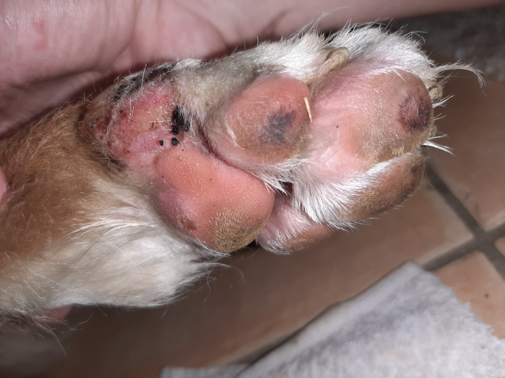
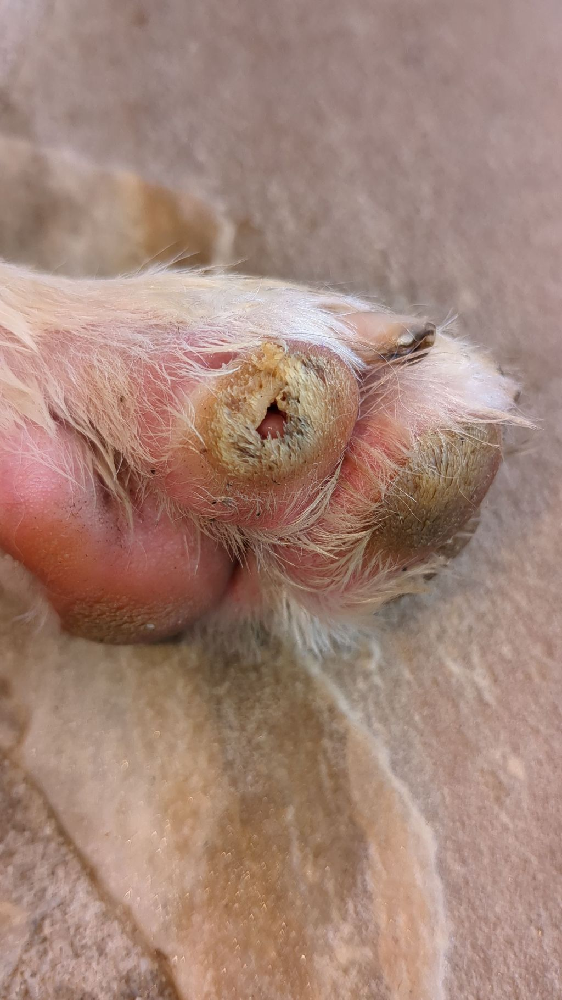
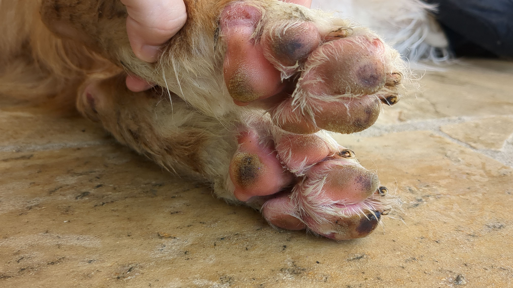
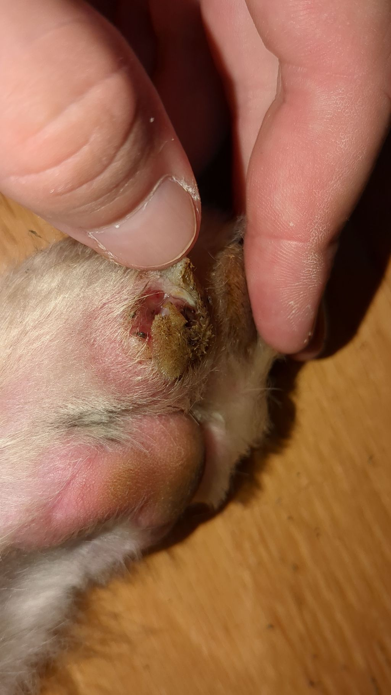

.. _2024_08:

.. |01-paw| image:: ../_static/img/2024-08-01_paw_front.jpg
   :class: wiki-img

.. |03-paw-back| image:: ../_static/img/2024-08-03_paw_back.jpg
   :class: wiki-img

.. |03-paw-front| image:: ../_static/img/2024-08-03_paw_front.jpg
   :class: wiki-img

.. |07-paw-back| image:: ../_static/img/2024-08-07_paw_back.jpg
   :class: wiki-img

.. |07-tounge| image:: ../_static/img/2024-08-07_tounge.jpg
   :class: wiki-img

.. |10-paw-back| image:: ../_static/img/2024-08-10_paw_back.jpg
   :class: wiki-img

.. |11-leg1| image:: ../_static/img/2024-08-11_leg.jpg
   :class: wiki-img

.. |11-leg2| image:: ../_static/img/2024-08-11_leg2.jpg
   :class: wiki-img

.. |13-paw-back| image:: ../_static/img/2024-08-13_paw_back.jpg
   :class: wiki-img

.. |15-paw-back| image:: ../_static/img/2024-08-15_paw_back.jpg
   :class: wiki-img

.. |15-paw-front1| image:: ../_static/img/2024-08-15_paw_front1.jpg
   :class: wiki-img

.. |15-paw-front2| image:: ../_static/img/2024-08-15_paw_front2.jpg
   :class: wiki-img

.. |15-paws-back| image:: ../_static/img/2024-08-15_paws_back.jpg
   :class: wiki-img

.. |15-paws-front| image:: ../_static/img/2024-08-15_paws_front.jpg
   :class: wiki-img

.. |15-bandage1| image:: ../_static/img/2024-08-15_bandage1.jpg
   :class: wiki-img

.. |15-bandage2| image:: ../_static/img/2024-08-15_bandage2.jpg
   :class: wiki-img

.. |15-elbow1| image:: ../_static/img/2024-08-15_elbow1.jpg
   :class: wiki-img

.. |15-elbow2| image:: ../_static/img/2024-08-15_elbow2.jpg
   :class: wiki-img

.. |15-full1| image:: ../_static/img/2024-08-15_full.jpg
   :class: wiki-img

.. |15-full2| image:: ../_static/img/2024-08-15_full2.jpg
   :class: wiki-img

.. |15-tounge| image:: ../_static/img/2024-08-15_tounge.jpg
   :class: wiki-img

.. |17-paw-back| image:: ../_static/img/2024-08-17_paw_back.jpg
   :class: wiki-img

.. |17-paw-front| image:: ../_static/img/2024-08-17_paw_front.jpg
   :class: wiki-img

.. |19-paw-back| image:: ../_static/img/2024-08-19_paw_back.jpg
   :class: wiki-img

.. |19-paw-front| image:: ../_static/img/2024-08-19_paw_front.jpg
   :class: wiki-img

.. |23-elbow| image:: ../_static/img/2024-08-23_elbow.jpg
   :class: wiki-img

.. |23-paw-front| image:: ../_static/img/2024-08-23_paw_front.jpg
   :class: wiki-img

.. |25-paw-back| image:: ../_static/img/2024-08-25_paw_back.jpg
   :class: wiki-img

.. |25-paw-front| image:: ../_static/img/2024-08-25_paw_front.jpg
   :class: wiki-img

.. |25-neck| image:: ../_static/img/2024-08-25_neck.jpg
   :class: wiki-img

.. |25-tounge| image:: ../_static/img/2024-08-25_tounge.jpg
   :class: wiki-img

=======
2024-08
=======

.. include:: ../_inc/head.rst

Status
******

2024-08-01
==========

Cortisone scheint nicht zu wirken - Dosis wird wieder auf 20mg/Tag verringert.

Schmerzmittel wird gespritzt.

Antibiotika werden wegen der Wunden verschrieben.

2024-08-03
==========

Cyclavance wird wieder eingesetzt (1.8ml/Tag).

Die hintere linke Pfote hat nun auch eine Tatze in der sich ein Loch bildet.

2024-08-09
==========

Die Zunge hat sich etwas eingependelt. Sie scheint zur Zeit nicht weiter zu 'verfallen'. Nur mehr auf der Unterseite ist ein kleiner weißer Punkt ersichtlich.

Die betroffenen Ballen der Linken Pfoten werden jedoch nach und nach schlechter.

Der Hund will sogar noch mit seinem Bällchen auf dem Rasen spielen - es geht ihm nicht wirklich schlecht. Leider bluten ihm nach dem gehen jedoch auch immer wieder die Pfoten.

2024-08-16
==========

Der Hund ist recht viel im Garten spazieren gegangen. Die wunden Pfoten scheinen ihn nicht übermäßig zu stören.

2024-08-19
==========

Pfoten werden nun zusätzlich mit Watte-Verbänden geschützt. (siehe Bild)

Es wird nun auch eine Honig-Salbe eingesetzt.

2024-08-21
==========

Der Zustand der vorderen Pfote scheint sich zu verbessern - sie hat wieder Gewebe aufgebaut.

Im Nackenbereich wurde beim Kraulen eine Verhärtung gefunden, welche mehrere cm² groß ist. (siehe Bild 25.08.)

----

Bilder
******

2024-08-01
==========

Vordere linke Pfote:

|01-paw|

2024-08-02
==========

|02-paw|

2024-08-03
==========

Vordere linke Pfote:

|03-paw-front|

Hintere linke Pfote:

|03-paw-back|

2024-08-07
==========

Zunge:

|07-tounge|

Vordere linke Pfote:

|07-paw-front|

Hintere linke Pfote:

|07-paw-back|

Beide hinteren Pfoten:

|07-paws-back|

2024-08-10
==========

Hintere linke Pfote:

|10-paw-back|

2024-08-11
==========

Ein größeres Stück Haare inklusive der Haut hat sich vom rechten Hinterbein gelöst:

|11-leg1|

Es war eigenartig verkrustet

|11-leg2|

2024-08-13
==========

Vordere linke Pfote:

|13-paw-front|

Hintere linke Pfote:

|13-paw-back|

2024-08-15
==========

Zunge:

|15-tounge|

Vordere linke Pfote:

|15-paw-front1|

|15-paw-front2|

Beide vorderen Pfoten:

|15-paws-front|

Hintere linke Pfote:

|15-paw-back|

Beide hinteren Pfoten:

|15-paws-back|

Verbände:

|15-bandage1|

|15-bandage2|

Ellenbogen:

|15-elbow1|

|15-elbow2|

Gesamt:

|15-full1|

|15-full2|

2024-08-17
==========

Vordere linke Pfote:

|17-paw-front|

Hintere linke Pfote:

|17-paw-back|

2024-08-19
==========

Neue Watte Verbände:

|19-paw-front|

|19-paw-back|

2024-08-23
==========

Vordere linke Pfote:

|23-paw-front|

Ellenbogen:

|23-elbow|

2024-08-25
==========

Vordere linke Pfote:

|25-paw-front|

Hintere linke Pfote:

|25-paw-back|

Zunge:

|25-tounge|

Verhärtung im Nackenbereich:

|25-neck|
